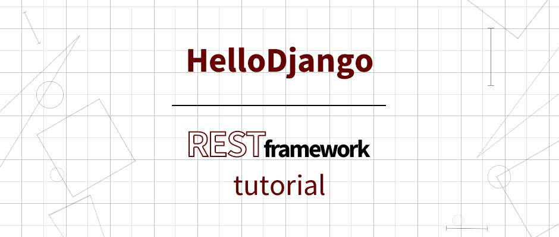

<p align="center">
  
  <br><strong>HelloDjango-REST-framework-tutorial</strong><br>
  <strong>完全免费、开源的 HelloDjango 系列教程之 django REST framework 博客开发</strong>。<br>
</p>


<p align="center">
  <a href="https://raw.githubusercontent.com/521xueweihan/img/master/hellogithub/logo/weixin.png"></a>
  <a href="https://weibo.com/hellogithub"></a>
</p>

本项目延续自 [HelloDjango-blog-tutorial](https://github.com/HelloGitHub-Team/HelloDjango-blog-tutorial)，如果对 django 基础不是很熟悉，建议先学习  [HelloDjango - Django博客教程（第二版）](https://www.zmrenwu.com/courses/hellodjango-blog-tutorial/)，然后再进阶学习 django REST framework。

虽然项目延续自 [HelloDjango-blog-tutorial](https://github.com/HelloGitHub-Team/HelloDjango-blog-tutorial)，但只要你已有 django 基础（ORM、类视图、表单等），就可以直接开启本教程。两个教程在内容上并无联系，只是本教程借用了上一个教程的项目结构以及数据模型（Model）的定义。

## 分支说明

master 分支为项目的主分支，每一步关键功能的开发都对应一篇详细的教程，并和历史提交以及标签一一对应。例如第一篇教程对应第一个 commit，对应标签为 step1，依次类推。

## 资源列表

- 教程首发 HelloGitHub 微信公众号和 [追梦人物的博客](https://www.zmrenwu.com/)，在线学习地址：[HelloDjango - django REST framework 教程](https://www.zmrenwu.com/courses/django-rest-framework-tutorial/)
- 上一个项目 HelloDjango-blog-tutorial 的 [源码仓库](https://github.com/HelloGitHub-Team/HelloDjango-blog-tutorial)

## 本地运行

可以使用 Virtualenv、Pipenv、Docker 等在本地运行项目，每种方式都只需运行简单的几条命令就可以了。

> **注意：**
>
> 因为博客全文搜索功能依赖 Elasticsearch 服务，如果使用 Virtualenv 或者 Pipenv 启动项目而不想搭建 Elasticsearch 服务的话，请先设置环境变量 `ENABLE_HAYSTACK_REALTIME_SIGNAL_PROCESSOR=no` 以关闭实时索引，否则无法创建博客文章。如果关闭实时索引，全文搜索功能将不可用。
>
> Windows 设置环境变量的方式：`set ENABLE_HAYSTACK_REALTIME_SIGNAL_PROCESSOR=no`
>
> Linux 或者 macOS：`export ENABLE_HAYSTACK_REALTIME_SIGNAL_PROCESSOR=no`
>
> 使用 Docker 启动则无需设置，因为会自动启动一个包含 Elasticsearch 服务的 Docker 容器。

无论采用何种方式，先克隆代码到本地：

```bash
$ git clone https://github.com/HelloGitHub-Team/HelloDjango-REST-framework-tutorial.git
```

### Virtualenv

1. 创建虚拟环境并**激活虚拟环境**，具体方法可参考基础教程中的：[开始进入 django 开发之旅：使用虚拟环境](https://www.zmrenwu.com/courses/hellodjango-blog-tutorial/materials/59/#%E4%BD%BF%E7%94%A8%E8%99%9A%E6%8B%9F%E7%8E%AF%E5%A2%83)

2. 安装项目依赖

   ```bash
   $ cd HelloDjango-rest-framework-tutorial
   $ pip install -r requirements.txt
   ```

3. 迁移数据库

   ```bash
   $ python manage.py migrate
   ```

4. 创建后台管理员账户

   ```bash
   $ python manage.py createsuperuser
   ```

   具体请参阅基础教程中的 [创作后台开启，请开始你的表演](https://www.zmrenwu.com/courses/hellodjango-blog-tutorial/materials/65/)。

5. 运行开发服务器

   ```bash
   $ python manage.py runserver
   ```

6. 浏览器访问 http://127.0.0.1:8000/admin，使用第 4 步创建的管理员账户登录后台发布文章，如何发布文章可参考基础教程中的：[创作后台开启，请开始你的表演](https://www.zmrenwu.com/courses/hellodjango-blog-tutorial/materials/65/)。

   或者执行 fake 脚本批量生成测试数据：

   ```bash
   $ python -m scripts.fake
   ```

   > 批量脚本会清除全部已有数据，包括第 4 步创建的后台管理员账户。脚本会再默认生成一个管理员账户，用户名和密码都是 admin。

9. 浏览器访问：http://127.0.0.1:8000，可进入到博客首页

### Pipenv

1. 安装 Pipenv（已安装可跳过）

    ```bash
    $ pip install pipenv
    ```

2. 安装项目依赖

    ```bash
    $ cd HelloDjango-rest-framework-tutorial
    $ pipenv install --dev
    ```

    关于如何使用 Pipenv，参阅基础教程中：[开始进入 django 开发之旅](https://www.zmrenwu.com/courses/hellodjango-blog-tutorial/materials/59/) 的 Pipenv 创建和管理虚拟环境部分。

3. 迁移数据库

    在项目根目录运行如下命令迁移数据库：
    ```bash
    $ pipenv run python manage.py migrate
    ```

4. 创建后台管理员账户

   在项目根目录运行如下命令创建后台管理员账户
   
   ```bash
   $ pipenv run python manage.py createsuperuser
   ```

   具体请参阅基础教程中的 [创作后台开启，请开始你的表演](https://www.zmrenwu.com/courses/hellodjango-blog-tutorial/materials/65/)。

5. 运行开发服务器

   在项目根目录运行如下命令开启开发服务器：

   ```bash
   $ pipenv run python manage.py runserver
   ```

6. 浏览器访问 http://127.0.0.1:8000/admin，使用第 4 步创建的管理员账户登录后台发布文章，如何发布文章可参考基础教程中的：[创作后台开启，请开始你的表演](https://www.zmrenwu.com/courses/hellodjango-blog-tutorial/materials/65/)。

   或者执行 fake 脚本批量生成测试数据：

   ```bash
   $ pipenv run python -m scripts.fake
   ```

   > 批量脚本会清除全部已有数据，包括第 4 步创建的后台管理员账户。脚本会再默认生成一个管理员账户，用户名和密码都是 admin。

7. 在浏览器访问：http://127.0.0.1:8000/，可进入到博客首页。

### Docker

1. 安装 Docker 和 Docker Compose

3. 构建和启动容器

   ```bash
   $ docker-compose -f local.yml build
   $ docker-compose -f local.yml up
   ```

4. 创建后台管理员账户

   ```bash
   $ docker exec -it hellodjango_rest_framework_tutorial_local python manage.py createsuperuser
   ```

   其中 hellodjango_rest_framework_tutorial_local 为项目预定义容器名。

4. 浏览器访问 http://127.0.0.1:8000/admin，使用第 3 步创建的管理员账户登录后台发布文章，如何发布文章可参考基础教程中的：[创作后台开启，请开始你的表演](https://www.zmrenwu.com/courses/hellodjango-blog-tutorial/materials/65/)。

   或者执行 fake 脚本批量生成测试数据：

   ```bash
   $ docker exec -it hellodjango_rest_framework_tutorial_local python -m scripts.fake
   ```

   >  批量脚本会清除全部已有数据，包括第 3 步创建的后台管理员账户。脚本会再默认生成一个管理员账户，用户名和密码都是 admin。

5. 为 fake 脚本生成的博客文章创建索引，这样就可以使用 Elasticsearch 服务搜索文章

   ```bash
   $ docker exec -it hellodjango_rest_framework_tutorial_local python manage.py rebuild_index
   ```

   > 通过 admin 后台添加的文章会自动创建索引。

6. 在浏览器访问：http://127.0.0.1:8000/，可进入到博客首页。

## 线上部署

拼命撰写中...

## 教程目录索引

1. [开篇](https://www.zmrenwu.com/courses/django-rest-framework-tutorial/)
2. [django-rest-framework 是什么鬼？](https://www.zmrenwu.com/courses/django-rest-framework-tutorial/materials/91/)
3. [初始化 RESTful API 风格的博客系统](https://www.zmrenwu.com/courses/django-rest-framework-tutorial/materials/92/)

## 公众号
<p align="center">
  <br>
欢迎关注 HelloGitHub 公众号，获取更多开源项目的资料和内容。
</p>


## QQ 群

加入 QQ 群和更多的 django 开发者进行交流：

Django学习小组主群：696899473

## 版权声明

</a><br>本作品采用<a rel="license" href="https://creativecommons.org/licenses/by-nc-nd/4.0/deed.zh">署名-非商业性使用-禁止演绎 4.0 国际 </a>进行许可。